<div align="center">


# OpenVyapar ERP

**Free & Open-Source GST-Ready ERP for Indian Small Businesses**

[](https://laravel.com)
[](https://vuejs.org)
[](https://www.typescriptlang.org)
[](https://tailwindcss.com)
[](https://www.gnu.org/licenses/agpl-3.0)
[](https://github.com/manoranjan2050/OpenVyapar-ERP/stargazers)

A complete, production-ready ERP system built specifically for Indian small businesses and retailers. GST-compliant invoicing, real-time inventory, party ledger, Telegram/email alerts, Tally export, and much more — all in one beautiful, dark-mode-ready interface.

[🚀 Get Started](#-quick-start) · [💻 Portable](#-portable-edition-windows) · [📸 Screenshots](#-screenshots) · [✨ Features](#-features) · [🛠️ Tech Stack](#️-tech-stack) · [🤝 Contributing](#-contributing)

</div>

> **Default login** &nbsp;→&nbsp; Email: `admin@openvyapar.in` &nbsp;·&nbsp; Password: `password`
> *(Change the password after first login — Settings → Users)*

<div align="center">

</div>

---

## 📸 Screenshots

### Dashboard
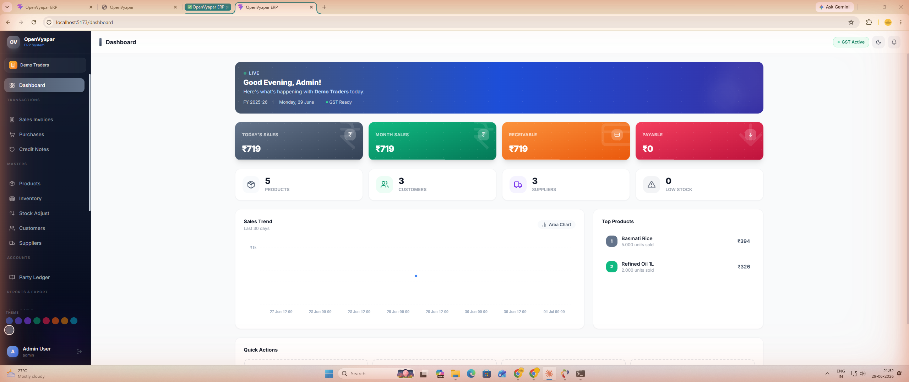
*Live KPI cards, sales trend chart, top products, quick actions*

### Sales Invoices
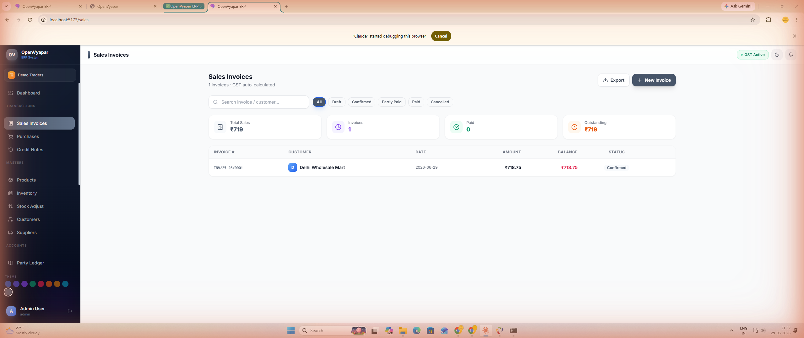
*GST-ready sales invoicing with auto tax computation, status tracking*

### Purchase Invoices
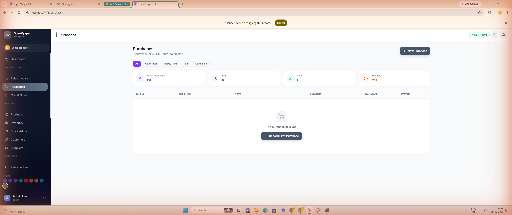
*Purchase management with ITC tracking and vendor payment status*

### Products & Catalogue
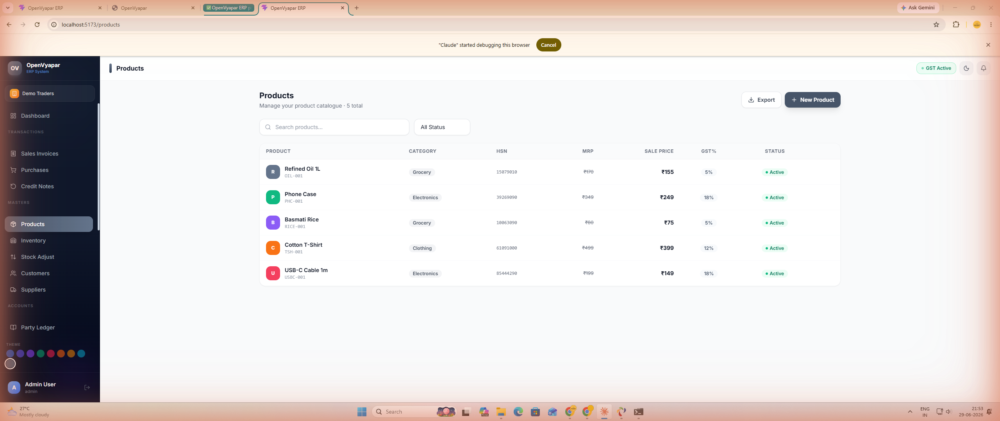
*Product master with HSN codes, GST slabs, unit management, low-stock alerts*

### Customers
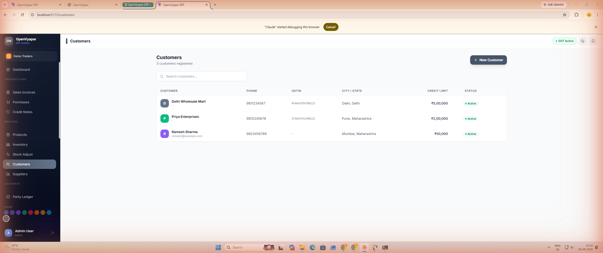
*Customer master with GSTIN, credit limit, opening balance, contact details*

### Party Ledger
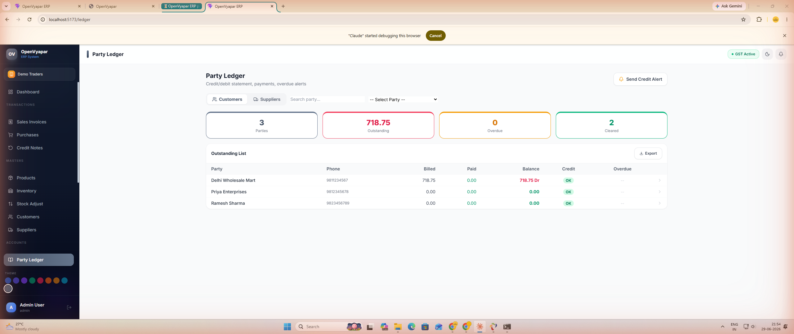
*Dr/Cr ledger with running balance, advance payments, credit status badges, overdue tracking*

### Inventory
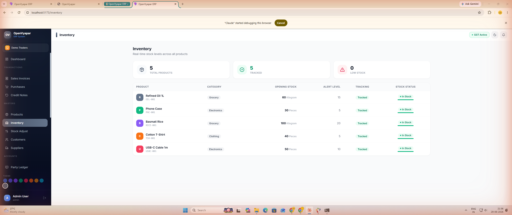
*Real-time stock levels with warehouse-wise view and stock transaction history*

### GST Reports
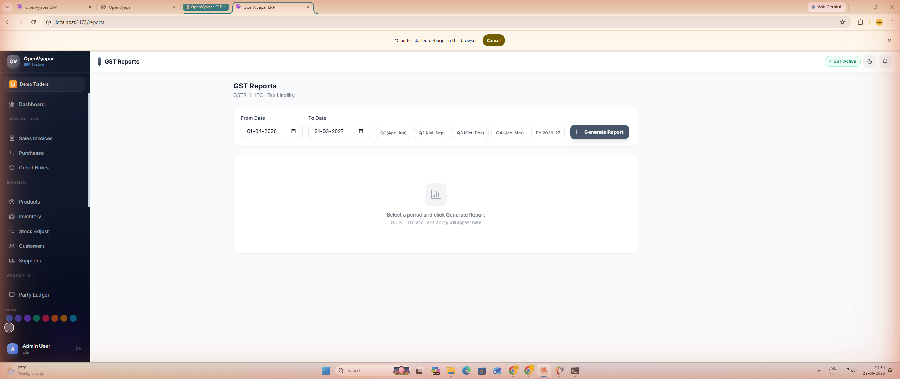
*GSTR-1, Input Tax Credit, and Tax Liability reports with date filters and Excel export*

### Alerts & Notifications
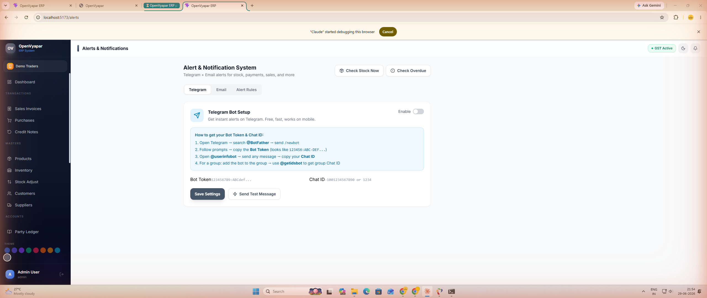
*Telegram bot + SMTP email alerts for stock, overdue payments, sales events and more*

### Activity Log
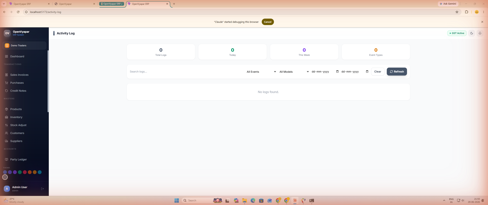
*Complete audit trail — every create, update, delete, login event with user and timestamp*

### Recycle Bin
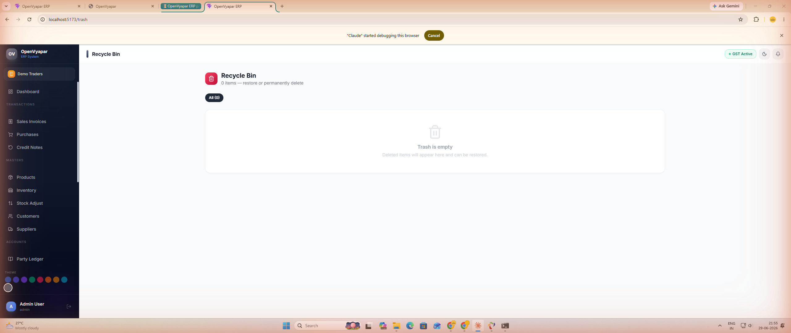
*Soft-delete recycle bin for all modules — restore or permanently delete items*

### Backup & Restore
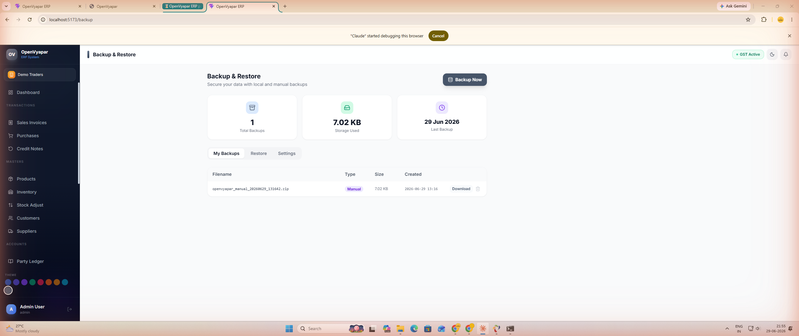
*One-click database backup (pure PHP, no mysqldump), download, restore from file*

### About
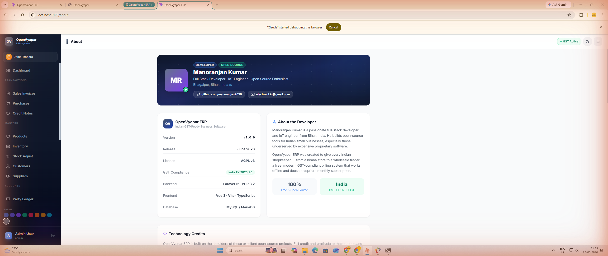
*Developer info, full tech stack credits, AGPL v3 licence declaration*

---

## ✨ Features

### 📦 Inventory & Products
- Product catalogue with HSN codes, GST tax slabs (0%, 5%, 12%, 18%, 28%), units of measure
- Real-time stock tracking with warehouse support
- Low-stock threshold alerts via Telegram / email
- Stock adjustment journal with reason codes
- Batch inventory view with valuation

### 🧾 Sales & Purchases
- GST-ready sales invoices with auto CGST/SGST/IGST computation
- Purchase invoices with ITC capture
- Auto invoice numbering (configurable prefix/series)
- Credit notes / returns management
- Invoice status: Draft → Unpaid → Partially Paid → Paid → Cancelled
- Print-ready invoice view

### 💳 Party Ledger (Accounts Receivable / Payable)
- Per-customer and per-supplier Dr/Cr ledger with running balance
- Opening balance (Dr/Cr) support
- 9 payment modes: Cash, UPI, Bank Transfer, Cheque, NEFT, RTGS, IMPS, Online, Other
- Advance payment tracking
- Credit limit with warning / exceeded status badges and progress bar
- Overdue invoice banner with aging
- Link payment directly to invoice (auto-updates status)
- Date range filter + Financial Year quick filter
- Export statement to Excel
- Send credit-due alert via Telegram / email (one click)

### 📊 GST Reports
- **GSTR-1**: B2B, B2C, export invoice summary
- **ITC (Input Tax Credit)**: purchase-side tax summary
- **Tax Liability**: net GST payable with breakdown
- Date range filters, company-wise isolation
- Excel export for all reports

### 📤 Tally Export
- One-click Tally XML export compatible with Tally ERP 9 / TallyPrime
- Configurable date range

### 🔔 Alerts & Notifications
| Alert Type | Telegram | Email |
|---|:---:|:---:|
| Low stock | ✅ | ✅ |
| Overdue payment | ✅ | ✅ |
| New sale recorded | ✅ | ✅ |
| New purchase | ✅ | ✅ |
| Daily summary | ✅ | ✅ |
| Backup completed | ✅ | ✅ |
| Credit note issued | ✅ | ✅ |
| New user created | ✅ | ✅ |

- Step-by-step BotFather setup guide built into the UI
- Custom SMTP or Gmail App Password support
- Manual "Run Check Now" for stock and overdue alerts
- Per-company settings

### 📋 Activity Log
- Full audit trail powered by Spatie Activity Log
- Filters: event type, model, user, date range, keyword search
- Colour-coded event badges: created (green), updated (blue), deleted (red), restored (violet), login (amber)
- Detail modal with before/after JSON diff
- Stats: total logs, today, this week, events by type

### 🗑️ Recycle Bin
- Soft-delete recycle bin for all 7 modules: Sales, Purchases, Products, Customers, Suppliers, Payments, Users
- Type-filter chips with item counts
- Per-item restore or permanent delete
- Restore All / Empty Trash with confirmation

### 💾 Backup & Restore
- Pure PHP-PDO database dump — no `mysqldump` binary required
- Zip packaging with embedded README
- Auto-prune (keeps last 20 backups)
- Download backup files
- Restore from file upload (.zip or .sql)
- Auto-backup settings: interval (hourly/daily/weekly), keep-last N, backup-on-close
- Statistics: count, total size, last backup time

### 🎨 UI & Theming
- **9 colour themes**: Ocean Blue, Royal Indigo, Deep Violet, Forest Green, Cherry Rose, Sunset Orange, Golden Amber, Teal Cyan, Cool Slate
- Theme switcher in sidebar — persisted to `localStorage`
- Full **dark mode** support
- Smooth page transition animations
- Responsive layout

### 👥 Users & Roles
- Multi-user with role-based access (Spatie Permissions)
- Admin / Staff role support
- User management page

---

## 🛠️ Tech Stack

| Layer | Technology |
|---|---|
| Backend Framework | Laravel 12 |
| Authentication | Laravel Sanctum |
| Roles & Permissions | Spatie Laravel Permission |
| Activity Log | Spatie Laravel Activity Log |
| Database | MariaDB / MySQL |
| Frontend Framework | Vue 3 (Composition API) |
| Language | TypeScript 5 |
| Build Tool | Vite 5 |
| CSS Framework | Tailwind CSS 3 |
| State Management | Pinia |
| HTTP Client | Axios |
| Charts | ApexCharts (vue3-apexcharts) |
| Icons | Lucide Vue Next |
| Excel Export | SheetJS (xlsx) |
| Dark Mode | @vueuse/core |
| Routing | Vue Router 4 |
| Containerisation | Docker + Nginx |

---

## 💻 Portable Edition (Windows)

No installation needed — extract and run.

1. Download `OpenVyapar-ERP-Portable-v1.2.0-Windows.zip` from [Releases](https://github.com/manoranjan2050/OpenVyapar-ERP/releases)
2. Extract the ZIP anywhere (e.g. `D:\OpenVyapar\`)
3. Double-click **`OpenVyapar.exe`** (GUI launcher) — or run `start.bat` for console mode
4. The app opens automatically in your browser at `http://localhost:8000`

**Default login credentials (Portable):**

| Field | Value |
|---|---|
| Email | `admin@openvyapar.in` |
| Password | `password` |

> The portable edition uses **SQLite** (no MySQL needed). All data is stored in `app\database\database.sqlite` inside the extracted folder. Back up that file to keep your data safe.

---

## 🚀 Quick Start

### Prerequisites
- PHP 8.2+
- Composer
- Node.js 20+
- MariaDB / MySQL 8+

### 1. Clone the repository
```bash
git clone https://github.com/manoranjan2050/OpenVyapar-ERP.git
cd OpenVyapar-ERP
```

### 2. Backend setup
```bash
cd backend
composer install
cp .env.example .env
php artisan key:generate
```

Edit `.env` with your database credentials:
```env
DB_DATABASE=openvyapar
DB_USERNAME=root
DB_PASSWORD=your_password
```

```bash
php artisan migrate --seed
php artisan serve --port=8000
```

### 3. Frontend setup
```bash
cd ../frontend
npm install
```

Create `frontend/.env`:
```env
VITE_API_URL=http://localhost:8000/api
```

```bash
npm run dev
```

### 4. Open in browser
```
http://localhost:5173
```

**Default login credentials:**

| Field | Value |
|---|---|
| Email | `admin@openvyapar.in` |
| Password | `password` |

> **Change the password** immediately after first login via Settings → Users.

### Docker (alternative)
```bash
cp backend/.env.example backend/.env
docker-compose up -d
```

---

## 📁 Project Structure

```
OpenVyapar-ERP/
├── backend/                  # Laravel 12 API
│   ├── app/
│   │   ├── Http/Controllers/Api/   # 18 API controllers
│   │   ├── Models/                 # 14 Eloquent models
│   │   └── Services/               # GstService, InventoryService, InvoiceNumberService
│   ├── database/
│   │   └── migrations/             # 21 migrations
│   └── routes/api.php              # All API routes
│
├── frontend/                 # Vue 3 SPA
│   └── src/
│       ├── layouts/          # AppLayout with sidebar + theme picker
│       ├── pages/            # 22 page components
│       ├── stores/           # Pinia stores (auth, theme)
│       ├── router/           # Vue Router config
│       └── api/              # Axios client
│
├── docker/                   # Dockerfiles + nginx config
├── docker-compose.yml
├── start-dev.bat             # Windows one-click dev start
└── INSTALL.md
```

---

## 🔌 API Overview

| Module | Endpoints |
|---|---|
| Auth | `POST /auth/login`, `POST /auth/logout`, `GET /auth/me` |
| Dashboard | `GET /dashboard` |
| Products | CRUD + `/low-stock`, `/stock` |
| Customers / Suppliers | Full CRUD |
| Sales Invoices | CRUD + cancel + payment |
| Purchase Invoices | CRUD + payment |
| Party Ledger | summary, detail, statement, record payment, credit alert |
| GST Reports | `/reports/gstr1`, `/reports/itc`, `/reports/tax-liability` |
| Tally Export | `GET /tally/export` |
| Alerts | settings, rules CRUD, test, run checks |
| Activity Log | paginated list, stats, detail |
| Recycle Bin | list, restore, force-delete, empty |
| Backup | list, create, download, restore, settings |
| Users | CRUD with roles |

---

## ⚙️ Configuration

### Telegram Alerts
1. Open Telegram → search `@BotFather`
2. Send `/newbot` and follow the prompts → copy the **Bot Token**
3. Start a chat with your bot, then visit `https://api.telegram.org/bot{TOKEN}/getUpdates` to get your **Chat ID**
4. In the app → **Alerts & Notifications** → Telegram tab → paste both values → Save → Send Test

### SMTP Email
Go to **Alerts & Notifications** → Email tab and enter:
- Alert email address
- SMTP host, port, username, password
- For Gmail: use an [App Password](https://myaccount.google.com/apppasswords) (not your main password)

---

## 🤝 Contributing

Contributions are welcome! Please:

1. Fork the repository
2. Create a feature branch (`git checkout -b feat/your-feature`)
3. Commit with clear messages following [Conventional Commits](https://www.conventionalcommits.org/)
4. Open a Pull Request

---

## 👨‍💻 Developer

<div align="center">

**MANORANJAN**

[](https://github.com/manoranjan2050)
[](mailto:manoranjan2050@live.com)
[](https://electroiot.in)

*Full-Stack Developer · IoT Engineer · Open Source Enthusiast*

</div>

---

## 📄 License

This project is licensed under the **GNU Affero General Public License v3.0 (AGPL-3.0)**.

This means:
- ✅ Free to use, study, and modify
- ✅ Free to distribute copies
- ✅ Must keep source code open when deployed as a network service
- ✅ Modifications must be released under the same AGPL-3.0 licence
- ❌ Cannot be used in proprietary/closed-source commercial products without releasing source

See the [LICENSE](LICENSE) file or [gnu.org/licenses/agpl-3.0](https://www.gnu.org/licenses/agpl-3.0) for full details.

---

## ⚠️ Disclaimer

This software is provided **"as is"**, without warranty of any kind. The developer is not responsible for any financial, legal, or compliance decisions made using this software. Always verify GST computations with a qualified CA before filing returns.

---

<div align="center">

Made with ❤️ in India &nbsp;·&nbsp; Built for Indian Small Business &nbsp;·&nbsp; AGPL v3 Open Source

⭐ **Star this repo** if OpenVyapar ERP helped you!

</div>
